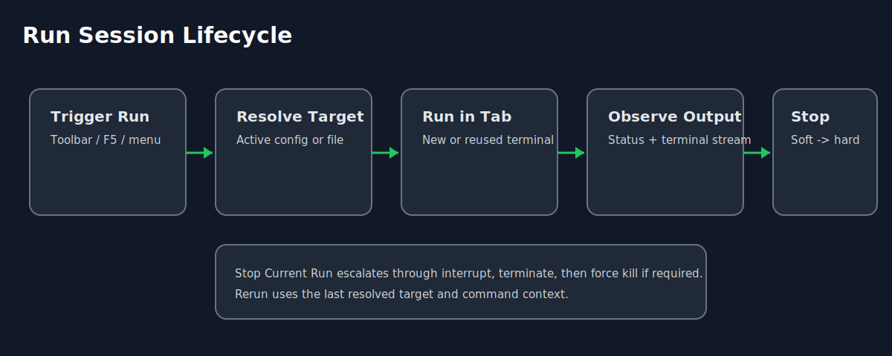

# Run and Terminal Model

PyTPO runs commands in managed terminal tabs with per-target session tracking.

## How target resolution works

When you trigger `Run`:

1. If an active Python run configuration exists, it is used.
2. Else if an active Cargo configuration exists, it is used.
3. Else PyTPO runs the current file context.

## Session behavior

Each run creates or reuses a terminal session keyed by run target.

A session tracks:

- label
- running state
- last command
- exit status

Recommended screenshot: `docs/assets/screenshots/07-terminal-run-output.png`

## Stop behavior

`Stop Current Run` escalates in stages:

1. interrupt
2. terminate
3. force kill

## Related docs

- [Run Configurations](../configuration/run-configurations.md)
- [Daily Development Workflow](../workflows/daily-development.md)
