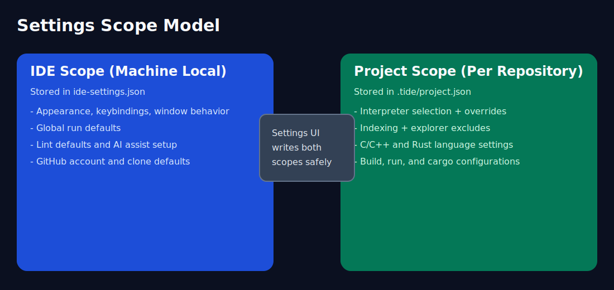

# Configuration

Configuration docs for IDE-scope and project-scope behavior.

- [IDE Settings](ide-settings.md)
- [Project Templates (`.pytpo/templates/*.json`)](project-templates.md)
- [Themes (`.qss` and `.qsst`)](themes.md)
- [Run Configurations](run-configurations.md)
- [Project Configuration (`.tide/project.json`)](project-json.md)
- [Project JSON Reference](project-json-reference.md)
