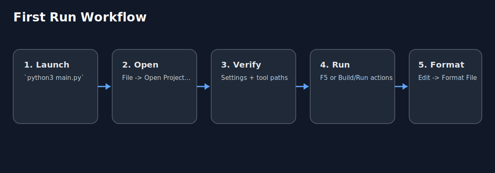

# Getting Started

This guide gets you from first launch to a productive edit/run loop.



## Prerequisites

Install tooling based on your stack:

- Python: `python3`, `ruff`
- C/C++: `clangd`, `cmake`, `clang-format`
- Rust: `rustup`, `cargo`, `rust-analyzer`, `rustfmt`

Quick checks:

```bash
python3 --version
ruff --version
clangd --version
cmake --version
clang-format --version
rust-analyzer --version
cargo --version
rustfmt --version
```

## 1. Launch PyTPO

From the repository root:

```bash
python3 main.py
```

Recommended screenshot: `docs/assets/screenshots/01-welcome-screen.png`

## 2. Open a project

1. Use `File -> Open Project...`.
2. Select your project folder.
3. PyTPO loads project settings from `.tide/project.json`.

Recommended screenshot: `docs/assets/screenshots/02-open-project-dialog.png`

## 3. Validate settings

Open `File -> Settings...` and check these pages:

- `Project -> Languages -> Python`
- `Project -> Languages -> C/C++` (if applicable)
- `Project -> Languages -> Rust` (if applicable)
- `Project -> Run -> Configurations`
- `IDE -> Run`

Recommended screenshot: `docs/assets/screenshots/03-settings-dialog-overview.png`

## 4. Run your code

- Python: press `F5` on a `.py` file, or use `Run -> Run Configuration`.
- C/C++: use `Run -> Build Current File` or `Run -> Build + Run Current File`.
- Rust: use `F5` on `.rs` or select a target from `Run -> Cargo Configuration`.

## 5. Format your code

Use `Edit -> Format File`.

Language formatters:

- [Python Formatting](formatting/python-formatting.md)
- [C/C++ Formatting](formatting/cpp-formatting.md)
- [Rust Formatting](formatting/rust-formatting.md)

## 6. Next steps

- [Daily Development Workflow](workflows/daily-development.md)
- [Run Configurations](configuration/run-configurations.md)
- [Troubleshooting](troubleshooting.md)
